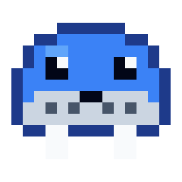
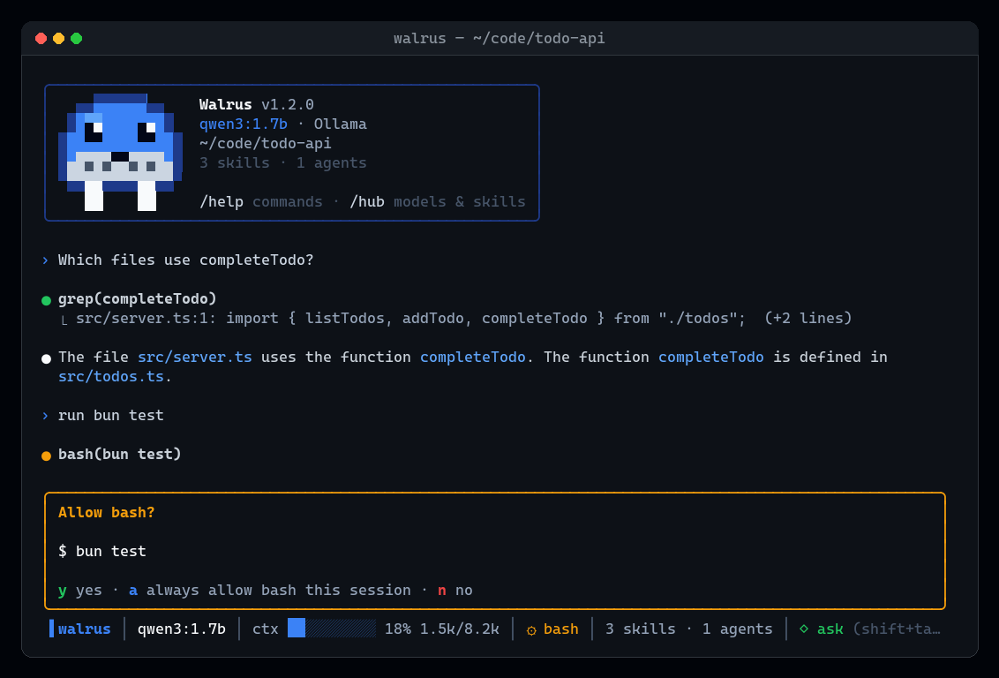
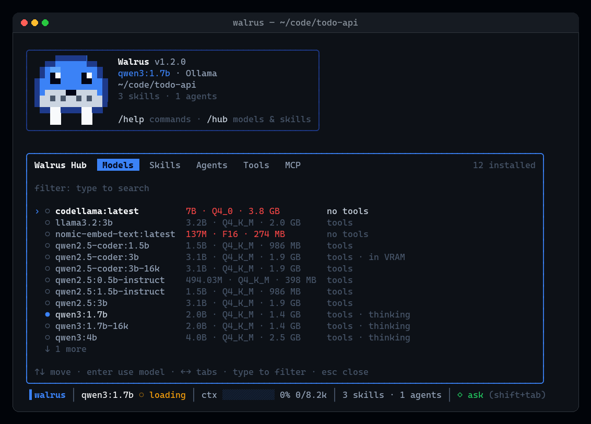
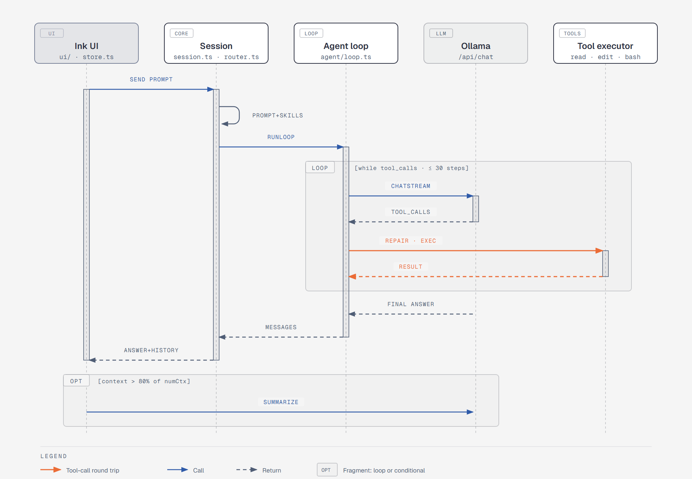

<div align="center">



# Walrus

**A coding agent for your terminal that runs entirely on your machine.**

Claude Code–style workflow — tools, skills, subagents, MCP — on small local models through [Ollama](https://ollama.com).
No API key, no cloud round-trip, nothing leaves your computer.

[](https://github.com/aaronk2001/walrus/actions/workflows/ci.yml)
[](LICENSE)




</div>

## Why

Frontier agents are great, but most day-to-day tasks — find a file, explain a function, patch a line, run the
tests — don't need a 400B model in a datacenter. Walrus brings the agent loop to models that fit on a laptop GPU
(the default, `qwen3:1.7b`, runs in 4 GB of VRAM), and spends its effort making those small models reliable:

- **Tool-call repair.** Small models misname tools (`functions.listDir`), send arguments as JSON strings, pass
  numbers as text, or print the call as plain JSON instead of emitting it. Walrus fixes all of that before the tool
  runs, and when an argument is missing it tells the model exactly what the tool expects.
- **Forgiving edits.** `edit_file` falls back to a whitespace-tolerant match when the model gets blank lines or
  indentation wrong, while still refusing ambiguous matches.
- **Skill routing.** Instead of stuffing every skill into the prompt, skill descriptions are embedded once and each
  request carries only the ~5 closest matches — small context windows stay small.
- **Asks before it acts.** Edits, shell commands and web fetches wait for your approval (with a diff) unless you
  switch to auto mode.

## Features

|  |  |
|---|---|
| 🧰 **11 built-in tools** | `read_file` `write_file` `edit_file` `list_dir` `grep` `bash` `web_fetch` `web_search` `todo_write` `skill` `agent` |
| 🧠 **Skills & subagents** | Reads the same `SKILL.md` and agent `.md` formats as Claude Code and OpenCode — your existing ones just work |
| 🔌 **MCP** | stdio and streamable-HTTP servers from your Claude Code / OpenCode config; read-only tools run freely, the rest ask |
| 💾 **Sessions** | Every conversation is saved; `walrus -c` or `/resume` picks it back up. Auto-compacts at 80% context |
| 📎 **`@file` attachments** | Type `@` to fuzzy-find a file and send its contents with your prompt |
| 🎛 **Hub** | `/hub` to pull and switch models, and toggle skills, agents, tools and MCP servers |
| 📊 **HUD** | Model, context usage, running tool, active subagent, todo progress and permission mode at a glance |
| 🔁 **OpenCode link** | `walrus opencode-sync` shares your models, MCP servers, agents and commands with [OpenCode](https://opencode.ai) |

<p align="center"></p>

## Quick start

You need [Ollama](https://ollama.com/download) and [Bun](https://bun.sh).

```bash
ollama pull qwen3:1.7b            # default model, ~1.4 GB
ollama pull nomic-embed-text      # optional: enables skill routing

git clone https://github.com/aaronk2001/walrus
cd walrus
bun install
bun start                         # run from source
```

To install a standalone `walrus` binary onto your PATH:

```bash
bun run build
./scripts/install.sh                                             # macOS / Linux  → ~/.local/bin/walrus
powershell -ExecutionPolicy Bypass -File scripts/install.ps1     # Windows        → ~\.local\bin\walrus.exe + Desktop shortcut
```

## Usage

```bash
walrus                      # interactive session in the current folder
walrus "explain this repo"  # start with a first prompt
walrus -c                   # continue the last conversation in this folder
walrus -p "count the TODOs" # print mode: answer and exit (edits, shell and fetches denied unless --yolo)
walrus -m llama3.2:3b       # use another model for this run
```

| Key | |
|---|---|
| `enter` | send |
| `ctrl+j`, or `\` then `enter` | new line |
| `@` | attach a file (tab completes) |
| `esc` | interrupt the model |
| `shift+tab` | toggle permission mode: **ask** (confirm edits, shell, fetches) / **auto** |
| `↑` `↓` | prompt history, or move through suggestions |
| `tab` | complete a `/` command, skill or `@` file |
| `ctrl+c` ×2 | quit |

| Command | |
|---|---|
| `/hub` | Models · Skills · Agents · Tools · MCP |
| `/model [name]` | switch model |
| `/resume` | reopen a saved conversation |
| `/compact` | summarize the conversation to free context |
| `/think` | toggle model thinking (off by default — much faster on small models) |
| `/clear` | new conversation |
| `/<skill> [request]` | run a skill directly |
| `/<command> [args]` | your prompt templates from `~/.walrus/commands` or `~/.claude/commands` (`$ARGUMENTS`, `$1`…) |

## How it works

<picture>
  <source media="(prefers-color-scheme: dark)" srcset="docs/diagrams/tool-call-loop-dark.png">
  
</picture>

- `src/agent/` — the loop, Ollama streaming client, tool-call repair and the built-in tools.
- `src/session.ts` — system prompt, skill routing and turn orchestration; `src/router.ts` does the embedding match.
- `src/catalog.ts`, `src/mcp.ts`, `src/opencode.ts` — discovery of skills, agents, MCP servers and OpenCode config.
- `src/ui/` — the Ink (React) terminal UI; `src/store.ts` holds app state in a Zustand store.

## Configuration

Walrus keeps its state in `~/.walrus/`: `config.json` (written by the hub), `sessions/`, `skills/`, `agents/`,
`commands/` and `mcp.json`.

| Key | Default | |
|---|---|---|
| `model` | `qwen3:1.7b` | chat model |
| `ollamaHost` | `http://localhost:11434` | |
| `numCtx` | `8192` | context window sent to Ollama |
| `embedModel` | `nomic-embed-text` | for skill routing; `""` lists all enabled skills instead |
| `skillTopK` | `5` | skills attached per request |
| `mode` | `ask` | `ask` or `auto` |
| `skillDirs` | `[]` | extra skill folders |

**Skills** are read from `~/.walrus/skills`, `~/.claude/skills`, `~/.agents/skills`, OpenCode's skill folders and
`skillDirs`. Skills you turned off in Claude Code start off here too. **Agents** come from `~/.walrus/agents`,
`~/.claude/agents` and OpenCode; each runs with its own prompt and the tools from its `tools:` line.
**Project instructions** from `WALRUS.md`, `CLAUDE.md` or `AGENTS.md` in the working folder go into the system prompt.

**MCP servers** are read from `~/.walrus/mcp.json`, `~/.claude.json`, `./.mcp.json`, enabled Claude Code plugins and
OpenCode's config. Every server starts **off** — turn it on in `/mcp`.

<details>
<summary><b>OpenCode integration</b></summary>

Walrus and [OpenCode](https://opencode.ai) share one setup, both ways.

**Walrus reads OpenCode's** agents, commands and skills from `~/.config/opencode/` and the project's `.opencode/`,
MCP servers from `opencode.json(c)`, and `AGENTS.md`.

**OpenCode gets Walrus's** with `/opencode` (or `walrus opencode-sync`), which writes into `~/.config/opencode/`:

- an **Ollama (local, via Walrus)** provider with 16k-context variants of your models (`qwen3:1.7b-16k`; add more
  with `/opencode llama3.2:3b`). The variants are Ollama aliases — no extra download.
- your MCP servers, on/off as in Walrus. Secrets stay as `{env:VAR}` and are never expanded into the file.
- your agents (as subagents, with permissions derived from their `tools:`) and slash commands.

Only entries Walrus created are ever updated or removed (tracked in `~/.walrus/opencode-sync.json`).

</details>

## Models

`qwen3:1.7b` is the default because it fits a 4 GB GPU at 8k context and supports native tool calls. Anything in
the hub tagged **tools** works; models tagged **no tools** can chat but not act. The first prompt waits for the
model to load (the HUD shows `◌ loading`), then it stays in memory for 30 minutes.

Bigger models are more reliable: `qwen2.5-coder:7b` or `qwen3:8b` are a good step up if you have the VRAM.

## Development

```bash
bun start           # run from source
bun test            # tools, agent loop + skill routing vs a fake Ollama, repair, sessions, MCP, UI, print mode
bun run typecheck
bun run build       # standalone binary in dist/
```

Tests never touch a real Ollama or your real config. CI runs typecheck, tests and a build on Linux, macOS and
Windows. `stubs/react-devtools-core` is an empty stand-in so `bun build --compile` can bundle Ink.

## License

[MIT](LICENSE)
